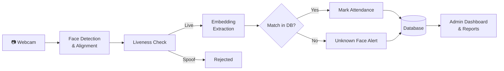

<div align="center">

# 🎯 Face Recognition Attendance System

### AI-Powered, Contactless Attendance Management using Deep Learning

[](#-roadmap)
[](https://www.python.org/)
[](https://fastapi.tiangolo.com/)
[](https://react.dev/)
[](https://opencv.org/)
[](#-license)

**A privacy-conscious system that marks attendance from a webcam using face detection, deep-learning embeddings, and liveness checks.**

[Overview](#-overview) •
[Features](#-features) •
[Architecture](#-architecture) •
[Quick Start](#-quick-start) •
[Evaluation](#-evaluation) •
[Team](#-project-team)

</div>

---

## 📖 Table of Contents

- [Overview](#-overview)
- [Features](#-features)
- [Architecture](#-architecture)
- [Tech Stack](#-tech-stack)
- [Repository Structure](#-repository-structure)
- [Quick Start](#-quick-start)
- [Evaluation](#-evaluation)
- [Privacy & Security](#-privacy--security)
- [Roadmap](#-roadmap)
- [Project Team](#-project-team)
- [Acknowledgements](#-acknowledgements)
- [License](#-license)

---

## 🧠 Overview

Manual attendance (roll calls, registers, cards) is slow, hard to audit, and open to **proxy attendance**. This project automates attendance using a **standard webcam**: it detects faces, converts them into numerical embeddings, matches them against enrolled people, and records attendance with a timestamp. A **liveness check** rejects photo and video replay attempts, and an **admin dashboard** handles enrollment and reports.

> 📌 **Project type:** BSCS Final Year Project, University of Sargodha
> 📷 **Input:** Webcam only (no IP/CCTV support)
> 🚧 **Status:** In development. Features below describe the planned system.

---

## ✨ Features

| Feature | Description |
|---------|-------------|
| 🎥 **Real-Time Recognition** | Detects and recognizes faces from a live webcam feed |
| 🛡️ **Liveness Detection** | Blink-based anti-spoofing to reject photos and video replays |
| 🧬 **Embedding-Based Matching** | Cosine-similarity matching; new people can be added without retraining |
| 📝 **Automatic Attendance** | Timestamped records with duplicate prevention |
| 🖥️ **Admin Dashboard** | Enrollment, attendance history, and reports |
| 📤 **Report Export** | Daily, monthly, and per-person reports in CSV/PDF |
| 🚨 **Unknown Face Alerts** | Flags unrecognized faces for review |
| 🔐 **Privacy-First Design** | Consent at enrollment, embeddings instead of raw images, role-based access |

---

## 🏗 Architecture



| Layer | Responsibility |
|-------|----------------|
| **Input** | Webcam capture |
| **Face Engine** | Detection, liveness, embeddings, matching |
| **Backend API** | Business logic, authentication, database access |
| **Database** | Users, embeddings, attendance logs |
| **Frontend** | Admin dashboard and live attendance view |

📚 Detailed design notes: [`backend/architecture`](./backend/architecture) • [`frontend/architecture`](./frontend/architecture)

---

## 🛠 Tech Stack

| Category | Technology |
|----------|------------|
| **Language** | Python, JavaScript |
| **Computer Vision** | OpenCV |
| **Deep Learning** | PyTorch (MTCNN / RetinaFace for detection, FaceNet / ArcFace for recognition) |
| **Backend** | FastAPI |
| **Database** | SQLite (development) / PostgreSQL (production) |
| **Frontend** | React |
| **Hardware** | Standard HD webcam (GPU optional) |

---

## 📁 Repository Structure

```
facerecognitionsystem/
├── backend/                 # FastAPI server and face engine
│   ├── architecture/        # Backend design notes and diagrams
│   └── app/                 # API, database, face engine (coming soon)
├── frontend/                # React admin dashboard
│   ├── architecture/        # Frontend design notes and diagrams
│   └── src/                 # Pages and components (coming soon)
├── docs/                    # Proposal, research notes, evaluation, screenshots
└── README.md
```

📚 See [`backend/README.md`](./backend/README.md) and [`frontend/README.md`](./frontend/README.md) for details.

---

## 🚀 Quick Start

> ⚠️ These steps will work once the code is added to `backend/` and `frontend/`.

### Prerequisites

- Python 3.9+
- Node.js 18+
- A working webcam

### 1. Clone the repository

```bash
git clone https://github.com/tubaayesha123/facerecognitionsystem.git
cd facerecognitionsystem
```

### 2. Run the backend

```bash
cd backend
python -m venv venv
source venv/bin/activate        # Windows: venv\Scripts\activate
pip install -r requirements.txt
cp .env.example .env            # then edit the values
uvicorn app.main:app --reload
```

API docs: **http://localhost:8000/docs**

### 3. Run the frontend

```bash
cd frontend
npm install
cp .env.example .env
npm run dev
```

Dashboard: **http://localhost:5173**

---

## 📊 Evaluation

The system will be evaluated on a **locally collected, consented dataset** under different lighting, angles, and accessories.

| Metric | Target |
|--------|--------|
| Recognition accuracy | ≥ 95% under normal lighting |
| False Acceptance Rate (FAR) | ≤ 1% at the chosen threshold |
| False Rejection Rate (FRR) | ≤ 5% at the chosen threshold |
| Recognition time | ≈ 1 second or less per person |
| Liveness (APCER / BPCER) | Reported for photo and screen-replay attacks |

> 📈 Results and ROC curves will be added in [`docs/`](./docs) after testing.

---

## 🔒 Privacy & Security

Face data is sensitive biometric information. This project follows these rules:

- ✅ Explicit **consent** from every enrolled person
- ✅ Stores **embeddings, not raw images**, wherever possible
- ✅ **Role-based access** for administrators only
- ✅ Deletion of a person's data on request
- ❌ Face images, datasets, model weights, and `.env` files are **never committed** to this repository

---

## 🗺 Roadmap

- [x] Project proposal and research
- [ ] Enrollment module
- [ ] Face detection and recognition pipeline
- [ ] Liveness detection
- [ ] Attendance logging and duplicate prevention
- [ ] Admin dashboard and reports
- [ ] Evaluation (FAR, FRR, ROC)
- [ ] Final documentation and presentation

**Future work:** ERP/HR integration, mobile app, multi-campus deployment.

---

## 👩‍💻 Project Team

| Name | Roll No. | Role |
|------|----------|------|
| **Tuba Rehman** | BSCS51F23S044 | Developer |
| **Ayesha Aslam** | BSCS51F23S028 | Developer |

**Supervisor:** Mr. Muhammad Fahad
**Institution:** University of Sargodha

---

## 🙏 Acknowledgements

- [FaceNet](https://arxiv.org/abs/1503.03832) and [ArcFace](https://arxiv.org/abs/1801.07698) for face embeddings
- [MTCNN](https://arxiv.org/abs/1604.02878) and [RetinaFace](https://arxiv.org/abs/1905.00641) for face detection
- [OpenCV](https://opencv.org/), [PyTorch](https://pytorch.org/), [FastAPI](https://fastapi.tiangolo.com/), and [React](https://react.dev/)

---

## 📄 License

This project is licensed under the **MIT License**.

---

<div align="center">

⭐ If you find this project interesting, consider giving it a star!

</div>
