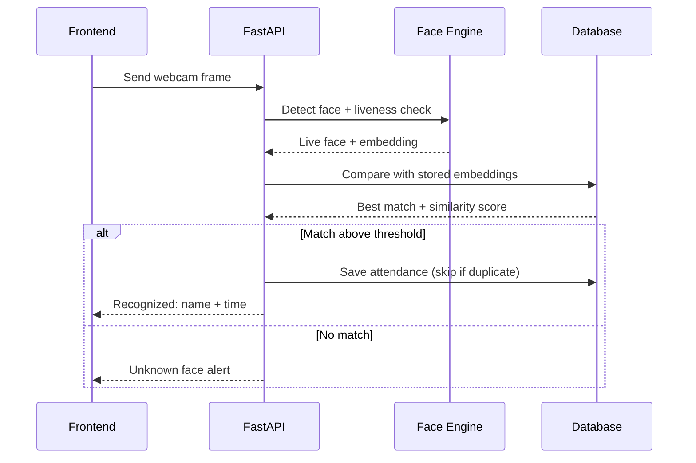

<div align="center">

# ⚙️ Backend: Face Recognition Attendance System

### FastAPI server for enrollment, recognition, attendance, and reports

[](https://www.python.org/)
[](https://fastapi.tiangolo.com/)
[](https://www.sqlalchemy.org/)
[](https://pytest.org/)

[⬅ Back to main README](../README.md)

</div>

---

## 📖 Table of Contents

- [Overview](#-overview)
- [How It Works](#-how-it-works)
- [Folder Structure](#-folder-structure)
- [Setup](#-setup)
- [Environment Variables](#-environment-variables)
- [API Endpoints](#-api-endpoints)
- [Database Design](#-database-design)
- [Face Engine Integration](#-face-engine-integration)
- [Testing](#-testing)
- [Security Notes](#-security-notes)

---

## 🧠 Overview

The backend is the central service of the system. It:

- Exposes a **REST API** used by the dashboard
- Handles **authentication** and role-based access for admins
- Calls the **face engine** to detect, verify liveness, and recognize faces
- Stores **users, embeddings, and attendance records** in the database
- Generates **reports** (daily, monthly, per person) and exports them as CSV/PDF

---

## 🔄 How It Works



---

## 📁 Folder Structure

```
backend/
├── app/
│   ├── main.py              # App entry point, router registration
│   ├── core/
│   │   ├── config.py        # Settings loaded from .env
│   │   └── security.py      # Password hashing, JWT tokens
│   ├── api/                 # Route handlers
│   │   ├── auth.py          # Login, logout
│   │   ├── users.py         # Manage students/employees
│   │   ├── enrollment.py    # Capture and store face embeddings
│   │   ├── attendance.py    # Mark and view attendance
│   │   └── reports.py       # Reports and CSV/PDF export
│   ├── models/              # Database tables (SQLAlchemy)
│   ├── schemas/             # Request/response validation (Pydantic)
│   ├── services/            # Business logic (attendance rules, reports)
│   └── db/
│       └── session.py       # Database connection
├── tests/                   # Automated tests
├── requirements.txt
├── .env.example
└── Dockerfile               # Optional
```

| Folder | Purpose |
|--------|---------|
| `api/` | Thin route handlers; they only receive requests and return responses |
| `services/` | The real logic, such as duplicate prevention and report generation |
| `models/` | Database tables |
| `schemas/` | Validates the data coming in and going out |
| `core/` | Configuration and security helpers |

---

## 🚀 Setup

```bash
# 1. Go to the backend folder
cd backend

# 2. Create and activate a virtual environment
python -m venv venv
source venv/bin/activate          # Windows: venv\Scripts\activate

# 3. Install dependencies
pip install -r requirements.txt

# 4. Create your environment file
cp .env.example .env              # edit values inside

# 5. Start the server
uvicorn app.main:app --reload
```

| URL | Description |
|-----|-------------|
| `http://localhost:8000` | API root |
| `http://localhost:8000/docs` | Interactive Swagger documentation |

---

## 🔧 Environment Variables

| Variable | Description | Example |
|----------|-------------|---------|
| `DATABASE_URL` | Database connection string | `sqlite:///./attendance.db` |
| `SECRET_KEY` | Secret used to sign login tokens | `change-this-in-production` |
| `ACCESS_TOKEN_EXPIRE_MINUTES` | Login session length | `60` |
| `MATCH_THRESHOLD` | Minimum similarity to accept a match | `0.50` *(tune using your ROC curve)* |
| `DUPLICATE_WINDOW_MINUTES` | Ignore repeat marks within this time | `30` |
| `CORS_ORIGINS` | Allowed frontend URLs | `http://localhost:5173` |

> ⚠️ Never commit your real `.env` file. Only `.env.example` goes to GitHub.

---

## 🌐 API Endpoints

> Edit this table to match your final routes.

| Method | Endpoint | Description | Access |
|--------|----------|-------------|--------|
| `POST` | `/auth/login` | Admin login, returns token | Public |
| `GET` | `/users` | List enrolled people | Admin |
| `POST` | `/users` | Add a new person | Admin |
| `DELETE` | `/users/{id}` | Delete a person and their face data | Admin |
| `POST` | `/enrollment/{user_id}` | Upload face images and store embeddings | Admin |
| `POST` | `/attendance/recognize` | Send a frame, get recognition result | Admin / Kiosk |
| `GET` | `/attendance` | View attendance records (with filters) | Admin |
| `GET` | `/reports/daily` | Daily report | Admin |
| `GET` | `/reports/monthly` | Monthly report | Admin |
| `GET` | `/reports/export?format=csv` | Export report as CSV/PDF | Admin |

---

## 🗄 Database Design

| Table | Main fields |
|-------|-------------|
| `admins` | id, username, password_hash, role |
| `users` | id, name, roll_no / employee_id, consent_given, created_at |
| `face_embeddings` | id, user_id, embedding, model_version, created_at |
| `attendance_records` | id, user_id, timestamp, confidence, liveness_passed |
| `unknown_faces` | id, timestamp, status *(for admin review)* |

> 💡 Store `model_version` with every embedding. Embeddings from different models cannot be compared with each other.

---

## 🤖 Face Engine Integration

The backend does **not** contain the AI code. It imports it from the [`face_engine/`](../face_engine/) module:

```python
# Example (adjust to your actual module names)
from face_engine.pipeline import process_frame

result = process_frame(frame)
# result -> { "live": True, "embedding": [...], "face_box": [...] }
```

The backend then compares the embedding with the database and applies attendance rules.

---

## 🧪 Testing

```bash
pip install pytest
pytest tests/ -v
```

---

## 🔒 Security Notes

- Passwords are **hashed**, never stored as plain text
- API routes for admins require a **valid token**
- Raw face images are **not stored** by default
- Enable HTTPS when deploying beyond a local machine
- Provide a way to **delete a person's data** on request
