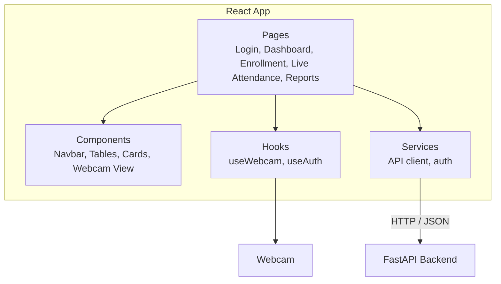
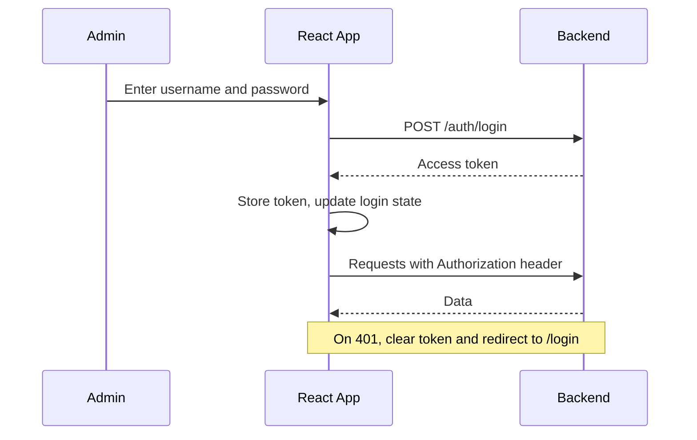
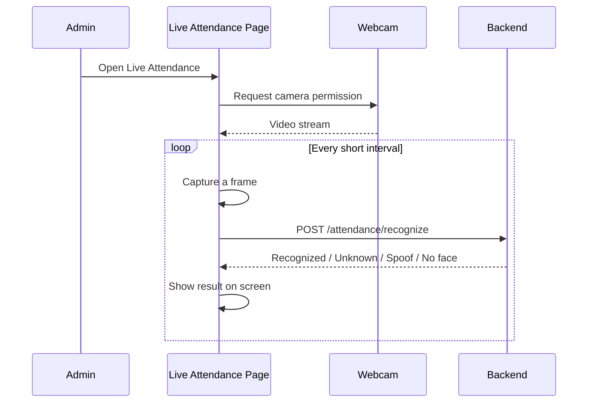

<div align="center">

# 🖥️ Frontend Architecture

### Face Recognition Attendance System

[⬅ Main README](../README.md) • [Frontend README](./README.md) • [Backend Architecture](../backend/architecture.md)

</div>

---

## 📖 Table of Contents

- [Overview](#-overview)
- [Design Principles](#-design-principles)
- [High-Level Architecture](#-high-level-architecture)
- [Pages and Routing](#-pages-and-routing)
- [Folder Responsibilities](#-folder-responsibilities)
- [Authentication Flow](#-authentication-flow)
- [Webcam and Attendance Flow](#-webcam-and-attendance-flow)
- [State Management](#-state-management)
- [API Layer](#-api-layer)
- [UI States and Feedback](#-ui-states-and-feedback)
- [Privacy in the UI](#-privacy-in-the-ui)
- [Error Handling](#-error-handling)
- [Performance Considerations](#-performance-considerations)
- [Testing and Build](#-testing-and-build)

---

## 🧠 Overview

The frontend is a **React** dashboard used by administrators. It lets them log in, enroll people, run live attendance with the webcam, and view or export reports. It does **not** run any face recognition itself: it captures webcam frames and sends them to the backend, then displays the result.

---

## 🎯 Design Principles

| Principle | What it means in this project |
|-----------|-------------------------------|
| **Thin client** | All recognition happens in the backend; the UI only captures and displays |
| **One place for API calls** | Pages never call `fetch` directly; they use the `services/` layer |
| **Reusable components** | Tables, cards, and the webcam view are shared across pages |
| **Clear feedback** | The user always knows if the system is scanning, recognized, or rejected |
| **Consent first** | Enrollment cannot start until consent is confirmed |

---

## 🏗 High-Level Architecture



| Layer | Responsibility |
|-------|----------------|
| **Pages** | Full screens, one per route |
| **Components** | Reusable UI pieces |
| **Hooks** | Reusable logic such as webcam access and login state |
| **Services** | All communication with the backend |

---

## 🧭 Pages and Routing

| Route | Page | Access | Purpose |
|-------|------|--------|---------|
| `/login` | Login | Public | Admin sign-in |
| `/` | Dashboard | Admin | Today's summary and charts |
| `/people` | People | Admin | List, add, delete enrolled people |
| `/enrollment/:id` | Enrollment | Admin | Capture face images (after consent) |
| `/live` | Live Attendance | Admin | Webcam view with real-time result |
| `/attendance` | Attendance History | Admin | Search and filter records |
| `/reports` | Reports | Admin | Daily/monthly reports and export |
| `/unknown` | Unknown Faces | Admin | Review unrecognized faces |

> 🔐 All routes except `/login` are wrapped in a **protected route** that redirects to login when there is no valid token.

---

## 📁 Folder Responsibilities

```
frontend/
├── architecture.md   # This document
├── README.md
└── src/
    ├── components/   # Reusable UI parts
    ├── pages/        # One file per route
    ├── services/     # API calls (api.js, auth.js)
    ├── hooks/        # useWebcam, useAuth
    ├── utils/        # Helpers (date formatting, etc.)
    ├── App.jsx       # Routes and layout
    └── main.jsx      # Entry point
```

| Folder | Rule |
|--------|------|
| `pages/` | Compose components and call services; keep them short |
| `components/` | No direct API calls; receive data through props |
| `services/` | The only place where requests to the backend are written |
| `hooks/` | Logic that is shared between pages |

---

## 🔐 Authentication Flow



> 💡 For a simple project, the token can be kept in memory or browser storage. For stronger protection in a real deployment, use secure `httpOnly` cookies.

---

## 📷 Webcam and Attendance Flow



**Notes**
- Webcam access works only on `localhost` or **HTTPS**.
- Frames are sent at a limited rate (not every video frame) to keep the system responsive.
- The result is shown clearly on screen (name and time, or a message).

---

## 🗃 State Management

| State | Where it lives |
|-------|----------------|
| **Login state / token** | Shared auth context (`useAuth`) |
| **Webcam stream** | `useWebcam` hook |
| **Page data** (people, records, reports) | Local state inside each page, loaded through `services/` |
| **UI state** (modals, filters) | Local component state |

Keep it simple: use React's built-in state and context first. Add a state library only if the project really needs it.

---

## 🔌 API Layer

All requests go through `services/api.js`, which:

- Reads the base URL from `VITE_API_URL`
- Adds the `Authorization` header automatically
- Handles common errors (for example, `401` redirects to login)
- Returns clean data to the pages

```
Page  →  service function  →  api.js  →  Backend
```

---

## 🎨 UI States and Feedback

The Live Attendance page shows a clear message for each situation:

| State | Message shown |
|-------|---------------|
| Camera not allowed | Ask the user to allow camera access |
| Scanning | "Looking for a face..." |
| Face recognized | Name, time, and "Attendance marked" |
| Already marked | "Attendance already recorded" |
| Unknown face | "Face not recognized" |
| Liveness failed | "Live face not detected" |
| Poor quality | "Please improve lighting or position" |

---

## 🔒 Privacy in the UI

- Enrollment starts only after the admin **confirms the person's consent**
- The UI **does not store** captured images; frames are sent to the backend and discarded
- Admin pages require login, and the user can **log out** at any time
- A person's data can be **deleted** from the People page

---

## 🚨 Error Handling

| Situation | Behavior |
|-----------|----------|
| Backend unreachable | Show a clear "cannot connect" message |
| Token expired (`401`) | Clear login state and redirect to `/login` |
| Validation error | Show the message next to the form field |
| Webcam error | Explain how to fix permission or device problems |

---

## ⚡ Performance Considerations

- Send a limited number of frames per second instead of every frame
- Stop the webcam stream when leaving the Live Attendance page
- Load report data with filters and pagination
- Use the production build (`npm run build`) for deployment

---

## 🧪 Testing and Build

| Area | Approach |
|------|----------|
| **Components** | Basic rendering tests for key components |
| **Services** | Test API functions with mocked responses |
| **Manual testing** | Check each page and each webcam state listed above |
| **Build** | `npm run build` creates the production files in `dist/` |
